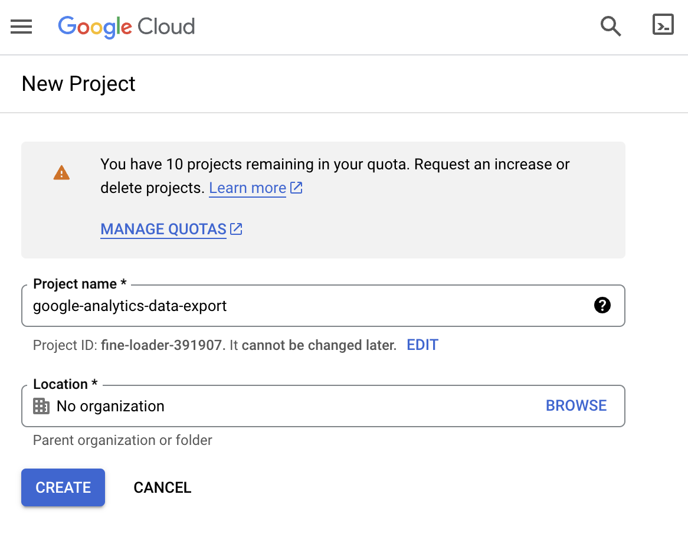
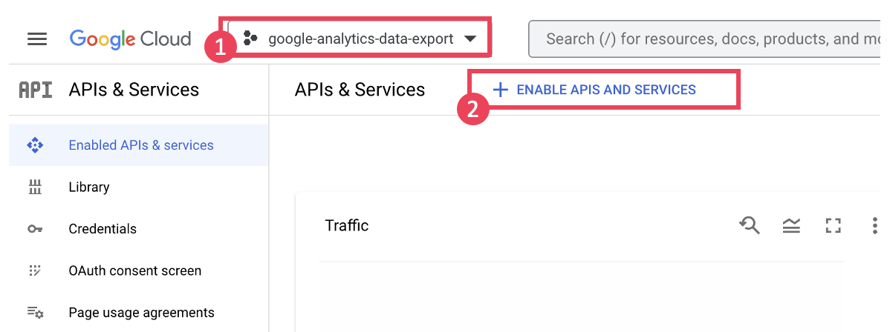
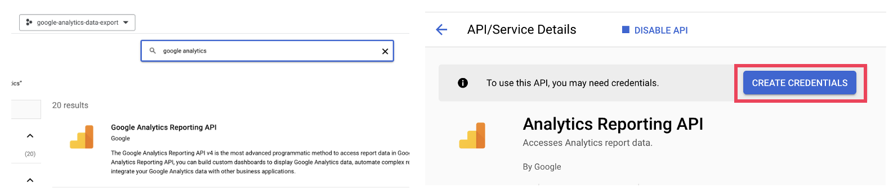
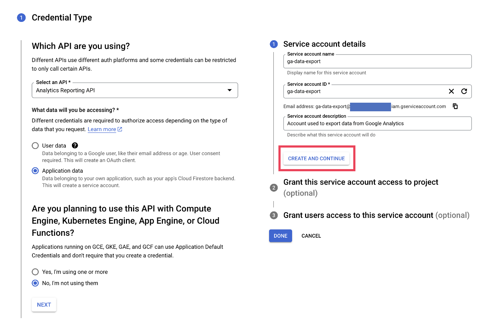
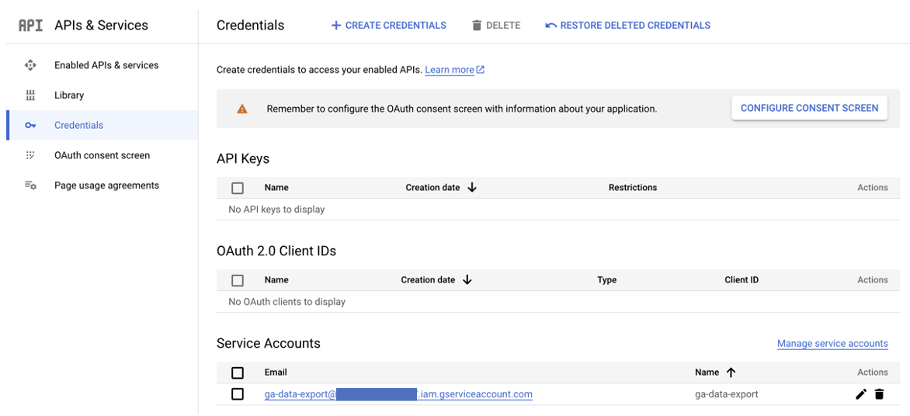
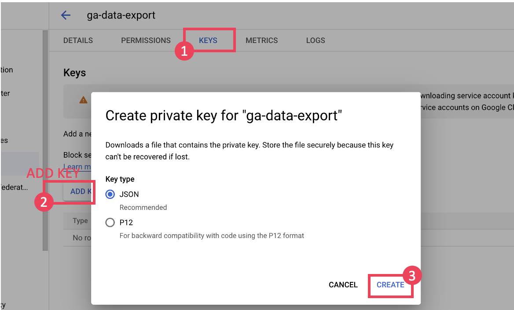
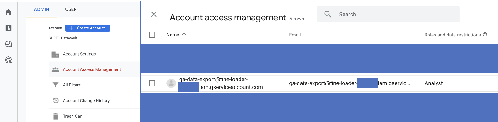
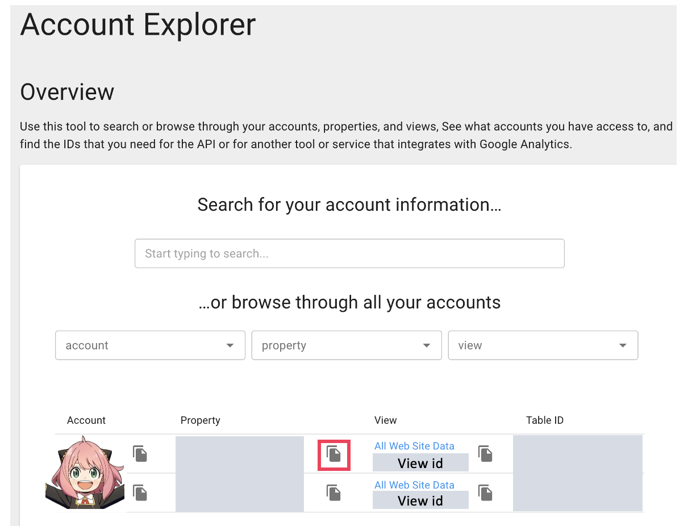

# Exporting Data from Google Analytics (GA4 & Google Analytics Reporting API v4).

This is a repostiory to store my Python Codes to search and export data from Google Analytics (GA4 & Google Analytics Reporting API v4).

### How to Use

1.  Download this repository to your local folder `git clone https://github.com/AnyaIp/Google-Analytics-Export.git`
2.  Make sure required Python packages are installed or you can simply say `pip install -r requirements.txt`.
   
   - google-oauth2-tool
   
   - google-api-python-client
   
   - pandas

3. Import my codes
   
   ```python
   from codes.query import *
   ```

4. Authentication
   
   Check the preparation section and if you do not know how to download the key file and find the view id of your Google analytics projects.
   
   ```python
   # Authentication
   # Define the path to the key file and the view id
   key_file_location = 'xxxxxxxxx.json'
   view_id = '123456789'
   auth = gaAuth(key_file_location, view_id)
   ```

5. Here are some examples, or you can check "examples.py".
   
   If you are not sure what metrics and dimensions are available, check on [GA4 Dimensions & Metrics Explorer](https://ga-dev-tools.google/ga4/dimensions-metrics-explorer/).
   
   - **Example 1**: Get the number of users and sessions by country (7 days ago - present)
   
   ```python
   ga = gaQuery(
       auth=auth,
       metrics=['ga:users', 'ga:sessions'],
       dimensions=['ga:country'],
       startDate='7daysAgo',
       endDate='today'
   )
   # save the outputs as a Pandas DataFrame
   df = ga.retrieve_data()
   print(df.head())
   ```
   
   - **Example 2**: Export the number of users and sessions by source channel (2021-05-01 to 2023-05-01) to and Excel file
   
   ```python
   ga = gaQuery(
       auth=auth,
       metrics=['ga:users'],
       dimensions=['ga:channelGrouping', 'ga:date'],
       startDate='2021-05-01',
       endDate='2023-05-01'
   )
   # export the data to an Excel file
   ga.to_excel(filename='examples.xlsx')
   ```

----

Below shows the steps of some preparation work, just in case you need help with the setup.

### Preparation Work

- Step 1. Generate Google Service Account Key

- Step 2. Grant Access to the Service Account

- Step 3. How to Find the Google Analytics Proejct View ID

##### Step 1. Generate Google Service Account Key

1. Go to [https://console.cloud.google.com/](https://console.cloud.google.com/) -> Create A Project



2. Go to https://console.cloud.google.com/apis/ and make sure your project is selected
   
   

3. Search and select **Google Analytics Reporting API** -> Click **Enable** -> **CREATE CREDENTIALS**

4. You should see the service account under **Credentials** -> Click on your service account, **ADD KEY** -> **CREATE** JSON file (This will trigger a download of the json file) -> **Remember** to copy email of the service account





##### Step 2. Grant Access to the Service Account

1. Go back to Google Analytics Dashboard -> Go to **Admin** -> Click on **Account Access Management** -> Paste the email of the service account and grant it **Analyst** rights



### Step 3. How to Find the Google Analytics Proejct View ID

1. Go to https://ga-dev-tools.google/account-explorer/, find the view id of your project
   
   
